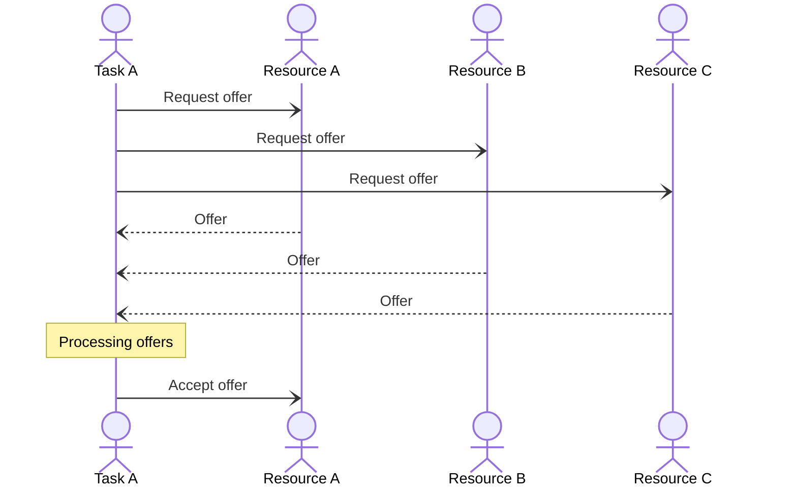
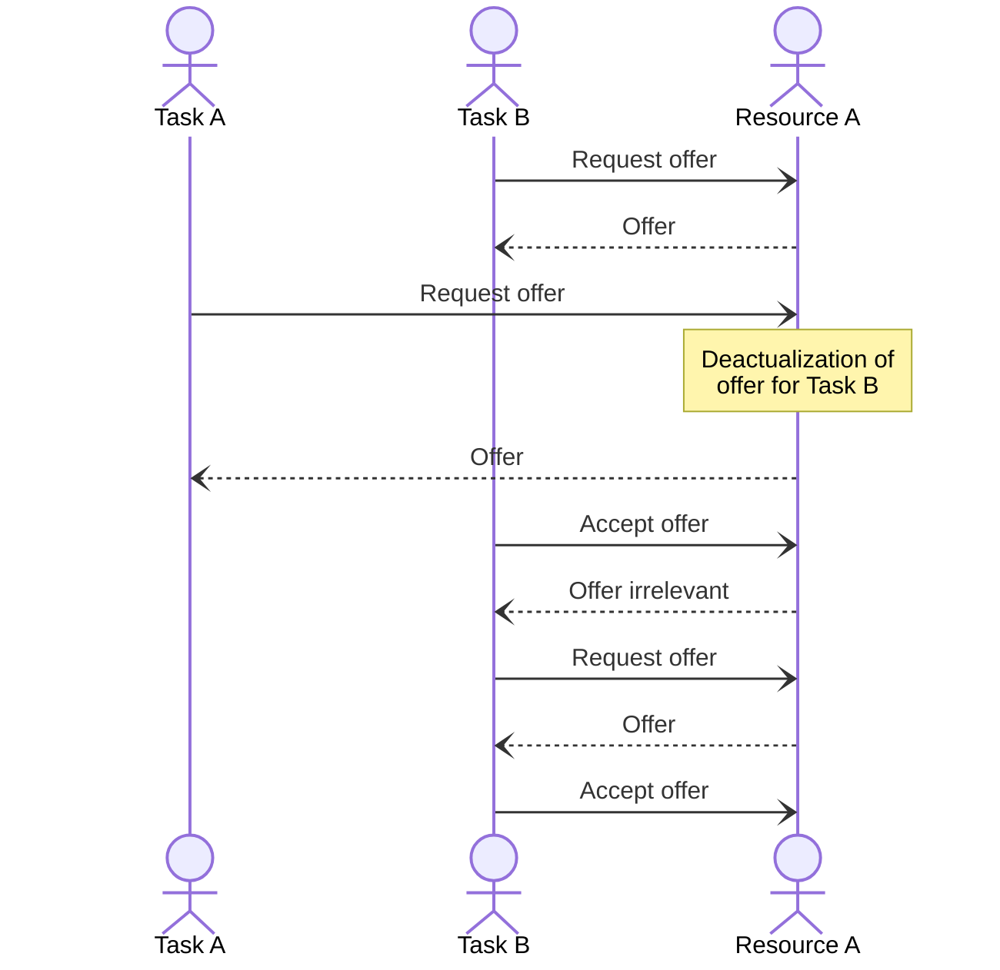
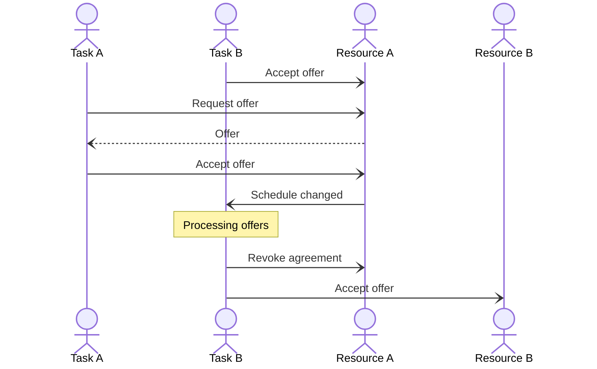

#### «Самарский государственный технический университет» (ФГБОУ ВО «СамГТУ»)

#### Кафедра «Вычислительная техника»

# Модель примитивной МАС для решения задачи распределения задач между ресурсами-исполнителями

**Автор:**  
студент 2-ИАИТ-114М  
Кирьяков Ф. М.  

Содержание:
[TOC]

## Модель взаимодействия агентов

Каждое сообщение в представленной модели является Dart-объектом,
название которого соответствует названию класса.  
Например, сообщение "Request offer" соответствует классу `RequestOfferMessage`, "Offer" - `OfferMessage` и т.д.  
> :warning:  
Для упрощения восприятия различные типы взаимодействия разбиты на отдельные диаграммы, внутри одной диаграммы сообщения передаются в каком-то осмысленном или отсортированном порядке.  
**В реальной жизни все сообщения передаются асинхронно и могут быть обработаны получателями в случайном порядке.**  

`Resource A` - наиболее производительный ресурс. `Resource C` - наименее производительный.  
`Task A` - наиболее приоритетная задача. `Task C` - наименее приоритетная.  

### Классическое принятие оффера

Идеальная картина, к сожалению, имеющая мало общего с реальностью.

### Конфликт бэклога ресурса

Когда ресурс отправляет отправляет оффер задаче, он сохраняет предложенную позицию в расписании в бэклог.  
После чего другая (более приоритетная) задача может получить оффер на более раннюю позицию, что деактуализирует все офферы на более позднюю позицию.  
Если задача пытается принять неактуальный оффер, ресурс отправляет сообщение о невозможности принять его, после чего задаче необходимо повторить запрос оффера, чтобы актуализировать его в своей памяти.

### Смещение задач в расписании

Иногда принятие оффера (или отказ от обслуживания) может сместить другие задачи в расписании, при этом эти задачи будут уведомлены об изменениях.  
Смещенная задача, при этом, может уйти к другому, более предпочтительному ресурсу.

В данном примере более приоритетная задача `Task A` вытесняет собой задачу `Task B`.  
Теперь менее производительный ресурс `Resource B` обработает её быстрее, чем `Resource A`, так как не придётся ждать выполнение задачи `Task A`.  
(Предполагается, что у `Task B` уже имеются актуальные офферы от обоих ресурсов.)

## Архитектура приложения

Весь исполняемый код находится в директории `lib/` в корне проекта.  
Внутри неё:
- `agents/` - всё основное, что относится к агентам
    - `base/` - базовые классы, необходимые для описания агента
        - `agent.dart` - базовый класс агента
        - `messages.dart` - базовые классы исходящих сообщений
        - `settings.dart` - базовый класс настроек инициализации агента
    - `resource/` - агент ресурса
        - `agent.dart` - класс агента
        - `messages.dart` - классы исходящих сообщений
        - `settings.dart` - класс настроек инициализации агента
    - `task/` - агент задачи
        - `agent.dart` - класс агента
        - `messages.dart` - классы исходящих сообщений
        - `settings.dart` - класс настроек инициализации агента
- `main.dart` - точка входа в приложение, здесь же находится:
    - прокси для широковещательной отправки сообщений
    - обработчик пользовательского ввода
- `messages.dart` - общие сообщения; сообщения, отправляемые из основного изолята
- `setup.dart` - стартовые настройки системы
- `shared.dart` - классы общих объектов системы

## Локальный запуск приложения:

### Пререквезиты:

- Dart SDK
    - [Скачать](https://dart.dev/get-dart)
    - [Гайд](https://dart.dev/tutorials/server/get-started)
    - Если запускать через VS Code, расширение может само предложить и установить SDK (но это не точно)

### Через VS Code (рекомендуется)

1. Установить [расширение](https://marketplace.visualstudio.com/items?itemName=Dart-Code.dart-code) Dart
2. Подождать окончания инициализации
3. Установить пакеты проекта  
    - VS Code должна сама предложить установить необходимые пакеты
    - Если нет, то вручную, командой `$ dart pub install`
4. F5

### Из консоли (не рекомендуется)

1. `$ cd` в директорию проекта
2. `$ dart pub get`
3. `$ dart run lib/main.dart`

## Материалы:

[Теория](https://github.com/Kiria-F/dart-mas-lab-assets/blob/main/01%20-%20%D0%92%D0%B2%D0%B5%D0%B4%D0%B5%D0%BD%D0%B8%D0%B5%20%D0%B2%20%D0%AD%D0%BC%D0%B5%D1%80%D0%B4%D0%B6%D0%B5%D0%BD%D1%82%D0%BD%D1%8B%D0%B8%CC%86%20%D0%B8%D0%BD%D1%82%D0%B5%D0%BB%D0%BB%D0%B5%D0%BA%D1%82%20-%202023.pdf)  
[Практика](https://github.com/Kiria-F/dart-mas-lab-assets/blob/main/%D0%9F%D0%BE%D1%81%D0%BE%D0%B1%D0%B8%D0%B5_%D0%BF%D0%BE_%D1%81%D0%BE%D0%B7%D0%B4%D0%B0%D0%BD%D0%B8%D1%8E_%D0%9C%D0%90%D0%A1_%D0%BD%D0%B0_Python_14.pdf) (На Python)  