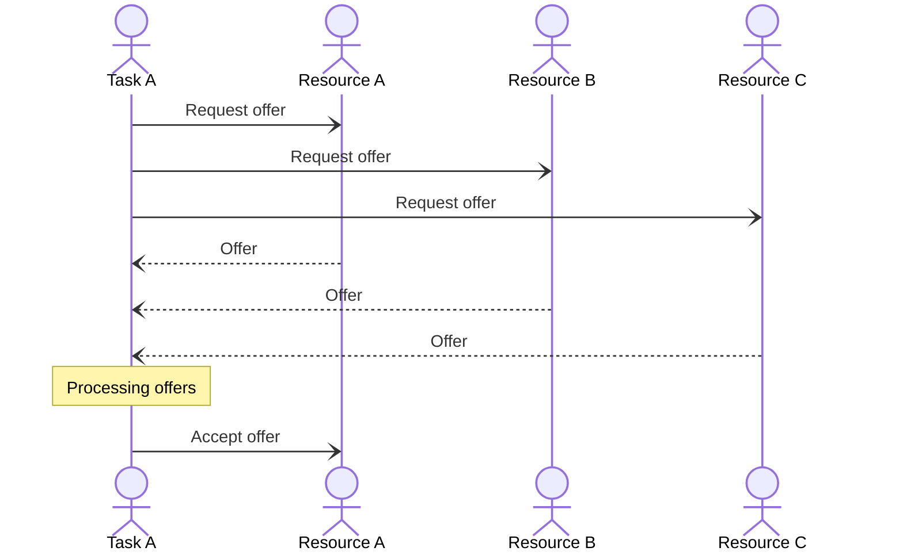
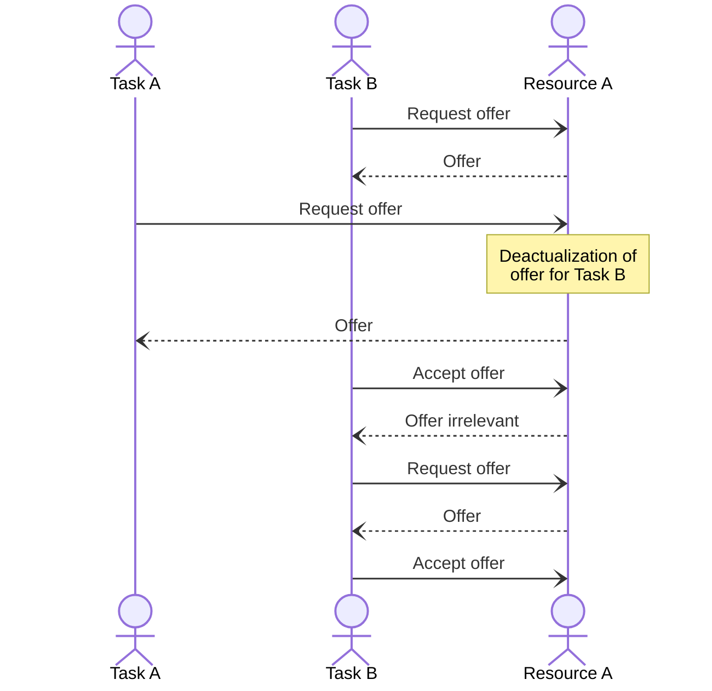
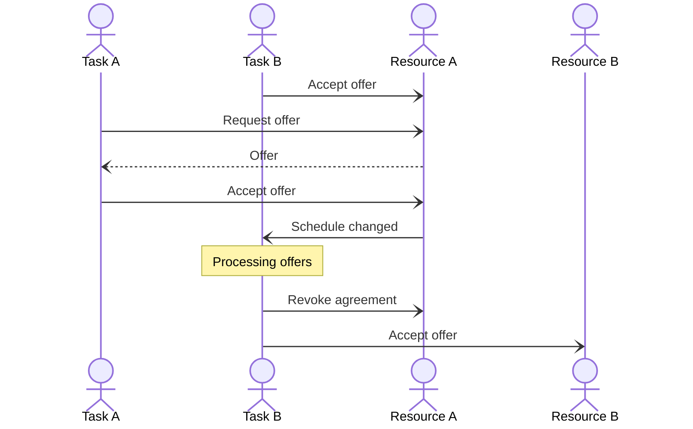

#### «Самарский государственный технический университет» (ФГБОУ ВО «СамГТУ»)

#### Кафедра «Вычислительная техника»

# Модель примитивной МАС для решения задачи распределения задач между ресурсами-исполнителями

**Автор:**  
студент 2-ИАИТ-114М  
Кирьяков Ф. М.  

Содержание:
- [Модель примитивной МАС для решения задачи распределения задач между ресурсами-исполнителями](#модель-примитивной-мас-для-решения-задачи-распределения-задач-между-ресурсами-исполнителями)
  - [Модель взаимодействия агентов](#модель-взаимодействия-агентов)
    - [Классическое принятие оффера](#классическое-принятие-оффера)
    - [Конфликт бэклога ресурса](#конфликт-бэклога-ресурса)
    - [Смещение задач в расписании](#смещение-задач-в-расписании)
  - [Архитектура приложения](#архитектура-приложения)
  - [Локальный запуск приложения:](#локальный-запуск-приложения)
    - [Пререквезиты:](#пререквезиты)
    - [Через VS Code (рекомендуется)](#через-vs-code-рекомендуется)
    - [Из консоли (не рекомендуется)](#из-консоли-не-рекомендуется)
  - [Демонстрация работы](#демонстрация-работы)
    - [Начальная конфигурация](#начальная-конфигурация)
    - [Запуск](#запуск)
    - [Добавление задачи](#добавление-задачи)
    - [Добавление ресурса](#добавление-ресурса)
    - [Опрос ресурсов](#опрос-ресурсов)
    - [Удаление задачи](#удаление-задачи)
    - [Удаление ресурса](#удаление-ресурса)
  - [Материалы](#материалы)

## Модель взаимодействия агентов

Каждое сообщение в представленной модели является Dart-объектом,
название которого соответствует названию класса.  
Например, сообщение "Request offer" соответствует классу `RequestOfferMessage`, "Offer" - `OfferMessage` и т.д.  
> :warning:  
Для упрощения восприятия различные типы взаимодействия разбиты на отдельные диаграммы, внутри одной диаграммы сообщения передаются в каком-то осмысленном или отсортированном порядке.  
**В реальной жизни все сообщения передаются асинхронно и могут быть обработаны получателями в случайном порядке.**  

`Resource A` - наиболее производительный ресурс. `Resource C` - наименее производительный.  
`Task A` - наиболее приоритетная задача. `Task C` - наименее приоритетная.  

### Классическое принятие оффера

Идеальная картина, к сожалению, имеющая мало общего с реальностью.



### Конфликт бэклога ресурса

Когда ресурс отправляет отправляет оффер задаче, он сохраняет предложенную позицию в расписании в бэклог.  
После чего другая (более приоритетная) задача может получить оффер на более раннюю позицию, что деактуализирует все офферы на более поздних позиций.  
Если задача пытается принять неактуальный оффер, ресурс отправляет сообщение о невозможности принять его, после чего задаче необходимо повторить запрос оффера, чтобы актуализировать его в своей памяти.



### Смещение задач в расписании

Иногда принятие оффера (или отказ от обслуживания) может сместить другие задачи в расписании, при этом эти задачи будут уведомлены об изменениях.  
Смещенная задача, при этом, может уйти к другому, более предпочтительному ресурсу.


В данном примере более приоритетная задача `Task A` вытесняет собой задачу `Task B`.  
Теперь менее производительный ресурс `Resource B` обработает её быстрее, чем `Resource A`, так как не придётся ждать выполнение задачи `Task A`.  
(Предполагается, что у `Task B` уже имеются актуальные офферы от обоих ресурсов.)

## Архитектура приложения

Весь исполняемый код находится в директории `lib/` в корне проекта.  
Внутри неё:
- `agents/` - всё основное, что относится к агентам
    - `base/` - базовые классы, необходимые для описания агента
        - `agent.dart` - базовый класс агента
        - `messages.dart` - базовые классы исходящих сообщений
        - `settings.dart` - базовый класс настроек инициализации агента
    - `resource/` - агент ресурса
        - `agent.dart` - класс агента
        - `messages.dart` - классы исходящих сообщений
        - `settings.dart` - класс настроек инициализации агента
    - `task/` - агент задачи
        - `agent.dart` - класс агента
        - `messages.dart` - классы исходящих сообщений
        - `settings.dart` - класс настроек инициализации агента
- `main.dart` - точка входа в приложение, здесь же находится:
    - прокси для широковещательной отправки сообщений
    - обработчик пользовательского ввода
- `messages.dart` - общие сообщения; сообщения, отправляемые из основного изолята
- `setup.dart` - стартовые настройки системы
- `shared.dart` - классы общих объектов системы

## Локальный запуск приложения:

### Пререквезиты:

- Dart SDK
    - [Скачать](https://dart.dev/get-dart)
    - [Гайд](https://dart.dev/tutorials/server/get-started)
    - Если запускать через VS Code, расширение может само предложить и установить SDK (но это не точно)

### Через VS Code (рекомендуется)

1. Установить [расширение](https://marketplace.visualstudio.com/items?itemName=Dart-Code.dart-code) Dart
2. Подождать окончания инициализации
3. Установить пакеты проекта  
    - VS Code должна сама предложить установить необходимые пакеты
    - Если нет, то вручную, командой `$ dart pub install`
4. F5

### Из консоли (не рекомендуется)

1. `$ cd` в директорию проекта
2. `$ dart pub get`
3. `$ dart run lib/main.dart`

## Демонстрация работы

### Начальная конфигурация

В качестве начальной конфигурации было взято два ресурса и две задачи:

```dart
class Setup {
  final SendPort rootPort;

  Setup(this.rootPort);

  List<ResourceSettings> get resourceSetup {
    return [
      ResourceSettings(rootPort: rootPort, name: 'R10', performance: 5),
      ResourceSettings(rootPort: rootPort, name: 'R9', performance: 4.5),
    ];
  }

  List<TaskSettings> get taskSetup {
    return [
      TaskSettings(rootPort: rootPort, name: 'A', info: TaskInfoCore(amount: 10, price: 90, rate: 0.30)),
      TaskSettings(rootPort: rootPort, name: 'B', info: TaskInfoCore(amount: 20, price: 85, rate: 0.25)),
    ];
  }
}
```

### Запуск

Вывод консоли:

```
Task [ A ] started searching for the resource

Task [ B ] started searching for the resource

Resource [ R10 ] got request for task [ B ]. Offer sent:
[   ]
  ^
  B

Resource [ R9 ] got request for task [ B ]. Offer sent:
[   ]
  ^
  B

Resource [ R9 ] got request for task [ A ]. Offer sent:
[   ]
  ^
  A

Resource [ R10 ] got request for task [ A ]. Offer sent:
[   ]
  ^
  A

Task [ B ] accepted offer from Resource [ R10 ]. Its new schedule:
[ B ]

Task [ A ] accepted offer from Resource [ R10 ]. Its new schedule:
[ AB ]

Task [ B ] accepted offer from Resource [ R9 ]. Its new schedule:
[ B ]

Task [ B ] revoked agreement with Resource [ R10 ]. Its new schedule:
[ A ]
```

Можно наблюдать, как обе задачи изначально выбрали наиболее производительный ресурс.  
Но после того, как задача `B` была смещена, она приняла решение перейти к другому, менее производительному, но свободному ресурсу.

### Добавление задачи

Создадим новую задачу `N` с характеристиками `amount=9`, `price=100`, `rate=0.35`.  
Ввод в консоль:

```
born task N 9 100 0.35
```

Вывод консоли:

```
Task [ N ] started searching for the resource

Resource [ R10 ] got request for task [ N ]. Offer sent:
[  A ]
  ^
  N

Resource [ R9 ] got request for task [ N ]. Offer sent:
[  B ]
  ^
  N

Task [ N ] accepted offer from Resource [ R9 ]. Its new schedule:
[ NB ]

Task [ B ] revoked agreement with Resource [ R9 ]. Its new schedule:
[ N ]

Resource [ R10 ] got request for task [ B ]. Offer sent:
[ A  ]
   ^
   B

Task [ B ] accepted offer from Resource [ R10 ]. Its new schedule:
[ AB ]
```

Первоначально новую задачу взял ресурс `R9`, что сместило в расписании задачу `B`.  
Задача `B` пересмотрела офферы и приняла решение перейти к ресурсу `R10`, ориентируясь на итоговое время выполнения.  
Теперь ресурс `R10` имеет две задачи в расписании. Попробуем добавить новый ресурс, предположительно, одна из задач на `R10` должна перейти к новому.  
Для этого выберем производительность ниже существующих, но не настолько, чтобы ресурс `R10` выполнил обе задачи быстрее нового.

### Добавление ресурса

Создадим новый ресурс `R8` с производительностью `performance=4`.

Ввод в консоль:

```
born resource R8 4
```

Вывод консоли:

```
Resource [ R8 ] got request for task [ A ]. Offer sent:
[   ]
  ^
  A

Resource [ R8 ] got request for task [ N ]. Offer sent:
[   ]
  ^
  N

Resource [ R10 ] got request for task [ A ]. Offer sent:
[  B ]
  ^
  A

Resource [ R8 ] got request for task [ B ]. Offer sent:
[   ]
  ^
  B

Resource [ R9 ] got request for task [ N ]. Offer sent:
[   ]
  ^
  N

Task [ B ] accepted offer from Resource [ R8 ]. Its new schedule:
[ B ]

Task [ A ] accepted offer from Resource [ R10 ]. Its new schedule:
[ AB ]

Task [ N ] accepted offer from Resource [ R9 ]. Its new schedule:
[ N ]

Task [ B ] revoked agreement with Resource [ R10 ]. Its new schedule:
[ A ]
```

Ресурс сообщил задачам о своем появлении, те, в свою очередь, запросили оффер и реорганизовались.  
Чтобы более ясно увидеть итогове размещение, опросим все ресурсы, чтобы получить их расписания.

### Опрос ресурсов

Ввод в консоль:

```
view
```

Вывод консоли:
```
Resource's [ R10 ] schedule:
[ A ]

Resource's [ R9 ] schedule:
[ N ]

Resource's [ R8 ] schedule:
[ B ]
```

Как и предполагалось, задачи распределились по одной на ресурс.

### Удаление задачи

Удалим задачу у самого производительного ресурса (`R10`). Предположительно, задачи должны реорганизоваться так, чтобы занять два наиболее производительных ресурса (`R9` и `R10`).

Ввод в консоль:

```
kill A
```

Вывод консоли:

```
Task [ A ] died

Resource [ R10 ] got request for task [ N ]. Offer sent:
[   ]
  ^
  N

Resource [ R10 ] got request for task [ B ]. Offer sent:
[   ]
  ^
  B

Task [ B ] revoked agreement with Resource [ R8 ]. Its new schedule:
[  ]

Task [ B ] accepted offer from Resource [ R10 ]. Its new schedule:
[ B ]

Resource [ R9 ] got request for task [ N ]. Offer sent:
[   ]
  ^
  N

Task [ N ] accepted offer from Resource [ R9 ]. Its new schedule:
[ N ]
```

Опросим ресурсы, чтобы увидеть расписание ресурса `R8`.

Ввод в консоль:

```
view
```

Вывод консоли:

```
Resource's [ R10 ] schedule:
[ B ]

Resource's [ R9 ] schedule:
[ N ]

Resource's [ R8 ] schedule:
[  ]
```

Действительно, расписание ресурса `R8` стало пустым.

### Удаление ресурса

Удалим ресурсы `R9` и `R10`, ожидается, что при этом задачи должны перейти к единственному оставшемуся ресурсу.

Ввод в консоль:

```
kill R9 R10
```

Вывод консоли:

```
Resource [ R9 ] died

Resource [ R10 ] died

Task [ N ] accepted offer from Resource [ R8 ]. Its new schedule:
[ N ]

Resource [ R8 ] got request for task [ B ]. Offer sent:
[ N  ]
   ^
   B

Task [ B ] accepted offer from Resource [ R8 ]. Its new schedule:
[ NB ]
```

В результате, как и ожадилось, все задачи перешли к ресурсу `R8`.

## Материалы

[Теория](https://github.com/Kiria-F/dart-mas-lab-assets/blob/main/01%20-%20%D0%92%D0%B2%D0%B5%D0%B4%D0%B5%D0%BD%D0%B8%D0%B5%20%D0%B2%20%D0%AD%D0%BC%D0%B5%D1%80%D0%B4%D0%B6%D0%B5%D0%BD%D1%82%D0%BD%D1%8B%D0%B8%CC%86%20%D0%B8%D0%BD%D1%82%D0%B5%D0%BB%D0%BB%D0%B5%D0%BA%D1%82%20-%202023.pdf)  
[Практика](https://github.com/Kiria-F/dart-mas-lab-assets/blob/main/%D0%9F%D0%BE%D1%81%D0%BE%D0%B1%D0%B8%D0%B5_%D0%BF%D0%BE_%D1%81%D0%BE%D0%B7%D0%B4%D0%B0%D0%BD%D0%B8%D1%8E_%D0%9C%D0%90%D0%A1_%D0%BD%D0%B0_Python_14.pdf) (На Python)  
